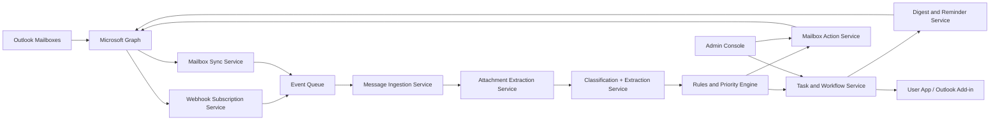

# Friendly Mail Technical Design

## Document Control

- Product: Friendly Mail
- Document type: Technical Design Document
- Version: v0.1
- Status: Draft
- Date: 2026-03-30
- Author: Codex technical draft
- Related documents:
  - `C:\Users\Sahil\OneDrive\Desktop\Friendly Mail\friendly-mail-prd.md`
  - `C:\Users\Sahil\OneDrive\Desktop\Friendly Mail\.planning\PROJECT.md`

## 1. Purpose

This document translates the Friendly Mail PRD into an engineering-facing system design. It defines the target architecture, key services, data model, Microsoft Graph integration approach, workflow states, and implementation constraints for the v1 product.

The central design requirement is delayed filing:

- Actionable emails must remain visible until the related action is completed, delegated, dismissed, or otherwise resolved.
- Informational emails must remain visible until the user has read them.
- Moving an email into a retrieval folder is therefore a workflow outcome, not an inbox-arrival action.

## 2. Scope

This document covers:

- System architecture
- Core services and responsibilities
- Mailbox sync and eventing model
- Task and workflow state model
- Delayed filing logic
- Data model
- Internal service APIs
- Security and permissions
- Operational risks and rollout assumptions

This document does not cover:

- Detailed UI mockups
- Final schema migrations
- Infrastructure-as-code
- Sprint planning or delivery estimates

## 3. Product-to-Architecture Translation

The PRD establishes five core product capabilities:

1. Smart classification and filing
2. Task extraction
3. Priority and criticality detection
4. Reminder and digest workflows
5. Workflow automation such as invoice routing and outgoing numbering

The architecture must support these while preserving one critical product truth:

- Mailbox state is not the same as work state.

That means Friendly Mail must maintain its own durable task and workflow model outside Outlook, while using Microsoft Graph as the mailbox source of truth and mailbox action layer.

## 4. Design Principles

- Keep unresolved work visible regardless of folder location
- Treat filing as a terminal or near-terminal step
- Use Microsoft Graph for mailbox operations, not as the only workflow system
- Prefer suggestion-first automation for high-risk actions
- Make all automated actions explainable and auditable
- Preserve user-specific filing logic while allowing organization-wide rules
- Use immutable message IDs to survive folder moves inside the same mailbox

## 5. External Platform Constraints

The design is anchored to current Microsoft Graph Outlook capabilities:

- Outlook mail data is available in primary and shared mailboxes through Microsoft Graph, but not in-place archive mailboxes.
- Outlook folders, categories, rules, messages, attachments, and send flows are Graph-accessible.
- Message IDs change when items are moved unless the app opts into immutable IDs using `Prefer: IdType="ImmutableId"`.
- Delta query for messages is per folder, so folder hierarchies must be tracked one folder at a time.
- Change notifications support message subscriptions, optional resource data, lifecycle notifications, and subscription renewal.
- The `message` resource includes key properties needed for this design, including `categories`, `parentFolderId`, `isRead`, `flag`, and `inferenceClassification`.

These constraints drive several decisions in the architecture below.

## 6. High-Level Architecture

## 7. Logical Components

### 7.1 Identity and Tenant Setup Service

Responsibilities:

- Register and manage Microsoft Entra app configuration
- Manage delegated versus application permission modes
- Store tenant, mailbox, and consent metadata
- Validate mailbox onboarding prerequisites

Notes:

- Delegated mode is preferred for user-assist scenarios.
- Application mode is recommended for shared mailbox and background workflow scenarios that require server-side continuity.

### 7.2 Microsoft Graph Connector

Responsibilities:

- Wrap Graph auth, retries, throttling, pagination, and headers
- Enforce `Prefer: IdType="ImmutableId"` on all supported message and attachment operations
- Normalize Graph responses into internal DTOs

Key behavior:

- All mailbox fetches, delta queries, message GETs, and subscriptions should consistently use immutable IDs where supported.

### 7.3 Subscription and Webhook Service

Responsibilities:

- Create and renew Graph subscriptions
- Validate incoming webhook requests
- Process lifecycle notifications
- Push notification events into the internal queue

Recommended strategy:

- Use mailbox-level or top-level message subscriptions where possible to reduce subscription sprawl.
- Avoid one subscription per folder unless product requirements force it.
- Use delta sync for state reconciliation after webhook receipt.

Rationale:

- Microsoft Graph supports up to 1000 active Outlook subscriptions per mailbox across all applications, so per-folder subscriptions do not scale well for deep personal filing trees.

### 7.4 Mailbox Sync Service

Responsibilities:

- Perform initial mailbox bootstrap
- Synchronize mail folders from the root
- Track messages per folder using delta query
- Reconcile missed or delayed webhook events

Design choice:

- Initial sync:
  - Sync folder tree from root
  - For each tracked folder, run message delta sync
- Ongoing sync:
  - Use webhooks for near-real-time triggers
  - Use folder-level delta sync as the durable reconciliation path

Important constraint:

- Because message delta is per folder, the service must store one `delta_link` per tracked folder.

### 7.5 Message Ingestion Service

Responsibilities:

- Fetch current message payload from Graph
- Normalize sender, recipients, thread, folder, body preview, read state, categories, and timestamps
- Compute idempotency keys and version state
- Enqueue attachment retrieval if needed

Output:

- A normalized internal `MessageEnvelope`

### 7.6 Attachment Extraction Service

Responsibilities:

- Retrieve attachment metadata and file content
- Extract text from PDFs and supported office documents
- Run OCR for scanned PDFs where enabled
- Produce structured extracted text and confidence scores

Design note:

- Attachment parsing is mandatory for notices, contracts, letters, and invoices because due dates and obligations may not be present in the email body.

### 7.7 Classification and Extraction Service

Responsibilities:

- Determine whether an email is actionable or informational
- Classify message type:
  - contract
  - notice
  - letter
  - policy
  - committee
  - event
  - invoice
  - internal
  - FYI
- Extract:
  - task candidates
  - due dates
  - counterparties
  - committee names
  - event names
  - invoice signals
  - urgency cues

Output:

- Structured classification result
- Confidence scores
- Human-readable explanation for important decisions

### 7.8 Rules and Priority Engine

Responsibilities:

- Apply deterministic business rules
- Merge rules with AI extraction output
- Compute criticality, priority, and routing decisions
- Decide whether a message is eligible for automated action or only suggestion mode

Examples:

- Government or regulatory notice -> mark critical
- Invoice with due date in 2 days -> mark critical and route
- Committee-related message -> route to committee bucketing logic
- Known low-risk informational mail -> category suggestion only

### 7.9 Task and Workflow Service

Responsibilities:

- Create and update first-class tasks
- Track task lifecycle independently from email folder location
- Link one or many tasks to one email
- Determine when an email becomes filing-eligible

This service is the system of record for:

- task state
- filing eligibility
- reminder eligibility
- criticality status

### 7.10 Mailbox Action Service

Responsibilities:

- Apply Graph mailbox actions
- Manage folder suggestions and folder moves
- Apply categories
- create drafts
- send or forward messages where authorized
- stamp outgoing reference numbers

Actions split into two classes:

- Immediate actions:
  - apply categories
  - create task link metadata
  - forward invoice email
  - create outgoing draft
- Deferred actions:
  - move email into retrieval folder

### 7.11 Digest and Reminder Service

Responsibilities:

- Morning digest generation
- Real-time urgent alerts
- End-of-day rollover summary
- Reminder generation based on due dates and criticality

Reminder logic should be driven by task state, not folder state.

### 7.12 User Surface

Expected user surfaces:

- Outlook add-in for in-context review and approval
- Web dashboard for task list, digests, and admin settings

Primary user actions:

- approve filing suggestion
- correct classification
- mark done
- delegate
- snooze
- dismiss
- mark informational item as reviewed if needed

## 8. Core Domain Model

### 8.1 Core Entities

- `Tenant`
- `Mailbox`
- `Folder`
- `Message`
- `Attachment`
- `ClassificationResult`
- `Task`
- `TaskSourceLink`
- `RoutingRule`
- `Digest`
- `AuditEvent`
- `OutgoingSequence`

### 8.2 Recommended Primary Keys

- Internal UUID for all internal entities
- Store Graph IDs separately
- For message lookups store:
  - `graph_message_id`
  - `internet_message_id`
  - `conversation_id`
  - `graph_parent_folder_id`
  - `mailbox_id`

### 8.3 Message Entity

Suggested fields:

- `id`
- `mailbox_id`
- `graph_message_id`
- `internet_message_id`
- `conversation_id`
- `graph_parent_folder_id`
- `subject`
- `from_address`
- `sender_address`
- `received_at`
- `sent_at`
- `is_read`
- `is_draft`
- `has_attachments`
- `importance`
- `inference_classification`
- `categories_json`
- `body_preview`
- `body_text`
- `body_html`
- `message_type`
- `actionability`
- `criticality`
- `filing_state`
- `filing_target_folder_id`
- `read_state_observed_at`
- `resolved_at`

### 8.4 Task Entity

Suggested fields:

- `id`
- `mailbox_id`
- `owner_user_id`
- `status`
- `title`
- `description`
- `priority`
- `criticality`
- `due_at`
- `source_message_id`
- `assigned_to`
- `created_by`
- `created_at`
- `updated_at`
- `resolved_at`
- `resolution_type`
- `confidence`

### 8.5 Filing State Model

Recommended `filing_state` values:

- `pending_classification`
- `active_actionable`
- `active_informational_unread`
- `eligible_to_file`
- `filed`
- `filing_blocked`

### 8.6 Rationale for Separate Filing State

A message can be:

- read but still unresolved
- moved but still actionable
- categorized but not ready to file
- task-complete but awaiting approved filing action

Therefore filing state must not be inferred from Outlook folder location alone.

## 9. Delayed Filing Logic

### 9.1 Required Product Rule

- If `actionability = actionable`, the message cannot be moved to a retrieval folder until all linked required tasks are resolved or the message is explicitly dismissed.
- If `actionability = informational`, the message cannot be moved to a retrieval folder until `isRead = true` or the user marks it as reviewed.

### 9.2 Decision Table

| Message Type | Read State | Task State | Filing Allowed | Reason |
|--------------|------------|------------|----------------|--------|
| Informational | Unread | None | No | User has not seen it |
| Informational | Read | None | Yes | Safe for retrieval filing |
| Actionable | Unread | Open | No | Work not yet surfaced/resolved |
| Actionable | Read | Open | No | Visibility must persist until action completion |
| Actionable | Read | Done | Yes | Safe to move to retrieval folder |
| Actionable | Read | Delegated | Configurable | Depends on business policy |
| Actionable | Read | Dismissed | Yes | User accepted no further action |

### 9.3 How Read Detection Works

Friendly Mail should use the Graph `message.isRead` property as the primary read-state signal.

Implementation note:

- Graph change notifications can signal updates when a message is marked read.
- The system should still fetch current message state or reconcile with delta to avoid acting on stale event payloads.

### 9.4 What Counts as Action Complete

V1 recommendation:

- `done`
- `dismissed`
- `resolved by workflow`

Configurable later:

- `delegated`
- `waiting on external party`

## 10. Graph Integration Model

### 10.1 Graph Capabilities Used

- Read messages and folders
- Read attachments
- Create folders and child folders
- Move messages
- Apply categories
- Create and manage inbox rules where appropriate
- Create drafts and send mail
- Send from another mailbox when permissions exist
- Subscribe to message changes
- Use delta query to maintain local state
- Use immutable IDs

### 10.2 Recommended Permission Shape

Delegated mode:

- `Mail.Read`
- `Mail.ReadWrite`
- `Mail.Send`
- `Mail.Send.Shared` where shared or delegated send flows are needed
- minimal directory/user scopes required for sign-in and user identification

Application mode:

- `Mail.Read`
- `Mail.ReadWrite`
- `Mail.Send`

Notes:

- Exact permission minimization should be finalized during tenant onboarding.
- Shared mailbox processing will usually require admin-consented application permissions or mailbox-specific delegated permissions plus Exchange mailbox grants.

### 10.3 Mailbox Coverage

Supported in v1:

- primary mailboxes
- shared mailboxes

Not supported in v1:

- in-place archive mailboxes

### 10.4 Message Identity Strategy

Default Graph message IDs change on move. Because Friendly Mail moves messages as part of the filing workflow, the connector must opt into immutable IDs on all supported operations:

- GET message
- list messages
- delta query
- subscription creation where supported

If immutable IDs are not consistently used, task links and audit trails will break when filing occurs.

### 10.5 Categories Strategy

Use Graph categories for lightweight visible tagging such as:

- `FriendlyMail/Critical`
- `FriendlyMail/Actionable`
- `FriendlyMail/Invoice`
- `FriendlyMail/Committee`

Use categories for visibility and retrieval, not as the only task state store.

### 10.6 Folder Strategy

Maintain two conceptual classes of folders:

- active working folders
  - Inbox
  - optionally user-managed work buckets
- retrieval folders
  - counterparty
  - subject-matter
  - committee
  - event
  - archived sent items

Friendly Mail should suggest the retrieval destination early, but should defer the move until filing eligibility is satisfied.

### 10.7 Custom App Data Strategy

Use internal database storage as the primary workflow source of truth.

Optionally use Graph-supported extension mechanisms for lightweight mailbox-linked metadata where useful:

- open extensions
- single-value extended properties
- custom Internet message headers when creating outbound messages

Recommended use cases:

- outgoing reference number
- internal correlation identifier
- workflow origin marker

## 11. Event Flows

### 11.1 Initial Mailbox Onboarding

1. Register mailbox in Friendly Mail
2. Discover folder tree from root
3. Create top-level message subscription
4. Run initial folder sync
5. Run message delta sync for each tracked folder
6. Backfill classification and task extraction
7. Build initial pending work list and digest baseline

### 11.2 New Incoming Message

1. Graph emits notification
2. Webhook service validates and queues event
3. Sync service fetches current message state
4. Ingestion service normalizes payload
5. Attachment service extracts file text if needed
6. Classification service determines actionability and type
7. Rules engine computes criticality, due dates, routing, and filing suggestion
8. Task service creates zero or more tasks
9. Mailbox action service may apply immediate actions such as categories or forwarding
10. Filing state remains active until read or resolution conditions are met

### 11.3 Informational Email Becomes Filing-Eligible

1. User reads message in Outlook
2. Graph notifies an update or sync detects `isRead = true`
3. Task service evaluates:
   - no open required task
   - informational classification
4. Filing state becomes `eligible_to_file`
5. Mailbox action service moves message into suggested retrieval folder if auto-move is enabled, or prompts the user for approval

### 11.4 Actionable Email Becomes Filing-Eligible

1. User completes or dismisses the linked task
2. Task service marks workflow resolved
3. Filing state becomes `eligible_to_file`
4. Mailbox action service moves the source email into the retrieval folder
5. Audit event is recorded with source folder, target folder, actor, and reason

### 11.5 Invoice Routing

1. Message classified as invoice
2. Rules engine identifies routing target such as Catherine
3. Mailbox action service forwards or re-routes per configured policy
4. Task is created for tracking due date and payment status
5. Message remains visible until routing and workflow conditions are satisfied

### 11.6 Outgoing Numbering

1. User creates draft through add-in or Friendly Mail action
2. Sequence service allocates next company-specific reference number
3. Draft subject/body are updated
4. Draft metadata is persisted internally and optionally as extension data
5. After send, sent item is reconciled using immutable ID
6. Sent message is filed according to policy

## 12. Internal Service APIs

These are internal logical APIs, not final public contracts.

### 12.1 Classification API

`POST /internal/classify-message`

Input:

- normalized message
- attachment text
- mailbox context
- user preferences

Output:

- actionability
- message type
- filing suggestion
- tasks
- due dates
- entities
- confidence scores
- explanation

### 12.2 Task Resolution API

`POST /internal/tasks/{taskId}/resolve`

Input:

- resolution type
- actor
- notes

Output:

- updated task
- filing eligibility decision for linked messages

### 12.3 Filing Decision API

`POST /internal/messages/{messageId}/evaluate-filing`

Output:

- current filing state
- target folder
- blocking reason
- whether auto-move is permitted

### 12.4 Mailbox Action API

`POST /internal/messages/{messageId}/apply-actions`

Supported actions:

- apply category
- move to folder
- create draft
- forward
- send

## 13. Storage Design

Recommended storage split:

- relational database for workflow state and reporting
- object storage for extracted attachment text and OCR artifacts
- queue for event processing
- secrets store for certificates, webhook validation data, and auth credentials

### 13.1 Tables

Minimum recommended tables:

- `tenants`
- `mailboxes`
- `folders`
- `folder_sync_state`
- `messages`
- `attachments`
- `message_classifications`
- `tasks`
- `task_message_links`
- `routing_rules`
- `filing_rules`
- `digests`
- `audit_events`
- `outgoing_sequences`

### 13.2 Idempotency

Use idempotency on:

- webhook event ingestion
- message classification
- attachment extraction
- task creation
- mailbox actions

Recommended keys:

- mailbox + graph message id + change key
- task source message id + extracted action fingerprint

## 14. Security and Compliance

### 14.1 Core Security Requirements

- Encrypt mailbox-derived data at rest and in transit
- Minimize stored body and attachment content where possible
- Scope Graph permissions to least privilege needed for enabled features
- Separate tenant data logically and physically according to environment
- Maintain an audit log for all user-visible and mailbox-mutating actions

### 14.2 Sensitive Content Handling

Because Friendly Mail may process legal notices, contracts, and invoices:

- redact or minimize unnecessary data in model prompts
- support configurable retention windows for extracted text
- log model decisions without storing excessive raw content where avoidable

### 14.3 Webhook Security

- Validate Graph subscription handshakes
- Verify notification authenticity
- Support encrypted resource-data notifications if adopted
- Handle lifecycle notifications to recover from missed changes

## 15. Reliability and Operations

### 15.1 Failure Handling

If any downstream step fails:

- preserve the mailbox event
- mark the message as partially processed
- retry safely
- avoid duplicate task creation or duplicate moves

### 15.2 Reconciliation

Use periodic folder delta reconciliation to repair:

- missed webhook deliveries
- stale read state
- changed categories
- moved messages
- deleted messages

### 15.3 Observability

Track:

- webhook latency
- delta sync lag
- classification latency
- attachment extraction failure rate
- task creation precision
- critical detection precision and recall
- auto-move rate
- user correction rate

## 16. Key Technical Risks

### 16.1 Attachment Parsing Quality

Risk:

- OCR and document extraction may fail for scanned or malformed PDFs.

Mitigation:

- confidence scoring
- manual review fallback
- separate extraction pipeline metrics

### 16.2 Trust Erosion from Incorrect Moves

Risk:

- a message is moved before it is safe, causing users to miss work.

Mitigation:

- delayed filing rule enforced in workflow service
- suggestion-first rollout
- audit trail and undo support

### 16.3 Shared Mailbox Complexity

Risk:

- shared mailbox permissions and send behavior vary by tenant and Exchange configuration.

Mitigation:

- mailbox capability checks at onboarding
- permission validation test suite
- fallback to recommendation-only mode where send/write operations are constrained

### 16.4 ID Drift

Risk:

- message references break if immutable ID headers are not used consistently.

Mitigation:

- centralize Graph access through a connector that always applies immutable ID behavior

## 17. Recommended Implementation Sequence

### Phase A: Platform Foundation

- Graph auth and mailbox onboarding
- folder sync and message sync
- immutable ID support
- webhook service and queue

### Phase B: Workflow Intelligence

- classification
- attachment extraction
- rules engine
- task store

### Phase C: Delayed Filing and Routing

- filing state machine
- retrieval folder suggestions
- invoice routing
- move gating based on read and resolution status

### Phase D: User Operations

- digest generation
- reminder workflows
- task resolution UI
- admin configuration

## 18. Open Technical Questions

- Should `delegated` task state allow auto-filing in v1, or remain visible until fully complete?
- Should the add-in support explicit "Mark reviewed" for informational items in addition to `isRead`?
- How should Friendly Mail represent multi-email tasks where several emails contribute to one work item?
- What attachment types beyond PDF are required for launch-quality extraction?
- What level of mailbox write capability should be required before a tenant is considered fully supported?

## 19. Recommended Decisions for v1

- Use Graph as mailbox source of truth and internal DB as workflow source of truth
- Enforce immutable IDs from day one
- Use categories immediately, but defer folder moves
- Create tasks for actionable messages even if the message is later moved
- Treat read state as sufficient for informational filing in v1, with optional "Mark reviewed" override
- Roll out auto-move only after trust thresholds are met

## 20. References

Official Microsoft Graph sources used:

- Outlook mail API overview: [https://learn.microsoft.com/en-us/graph/outlook-mail-concept-overview](https://learn.microsoft.com/en-us/graph/outlook-mail-concept-overview)
- Organize Outlook messages: [https://learn.microsoft.com/en-us/graph/outlook-organize-messages](https://learn.microsoft.com/en-us/graph/outlook-organize-messages)
- Delta query for messages: [https://learn.microsoft.com/en-us/graph/delta-query-messages](https://learn.microsoft.com/en-us/graph/delta-query-messages)
- Change notifications for Outlook resources: [https://learn.microsoft.com/en-us/graph/outlook-change-notifications-overview](https://learn.microsoft.com/en-us/graph/outlook-change-notifications-overview)
- Message resource type: [https://learn.microsoft.com/en-us/graph/api/resources/message?view=graph-rest-1.0](https://learn.microsoft.com/en-us/graph/api/resources/message?view=graph-rest-1.0)
- Attachment resource type: [https://learn.microsoft.com/en-us/graph/api/resources/attachment?view=graph-rest-1.0](https://learn.microsoft.com/en-us/graph/api/resources/attachment?view=graph-rest-1.0)
- Obtain immutable identifiers for Outlook resources: [https://learn.microsoft.com/en-us/graph/outlook-immutable-id](https://learn.microsoft.com/en-us/graph/outlook-immutable-id)
- Send Outlook messages from another user: [https://learn.microsoft.com/en-us/graph/outlook-send-mail-from-other-user](https://learn.microsoft.com/en-us/graph/outlook-send-mail-from-other-user)
- Automate creating, sending, and processing messages: [https://learn.microsoft.com/en-us/graph/outlook-create-send-messages](https://learn.microsoft.com/en-us/graph/outlook-create-send-messages)

## 21. Assumptions

- Friendly Mail will target Microsoft 365 and Exchange Online tenants
- Outlook remains the primary user interface for email
- The first production version optimizes for trust and workflow safety over maximum automation
- The delayed filing behavior described in the PRD is a hard product requirement, not a soft preference
